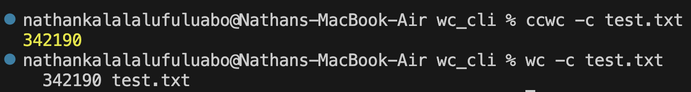
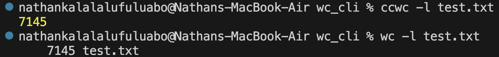
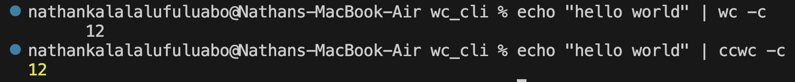
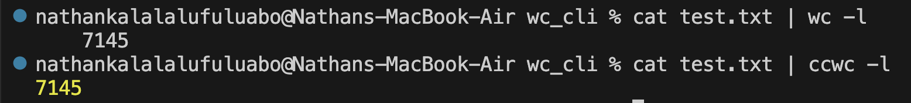

# WC (Replica)

## Introduction

This project was built to complete the coding challenge from https://codingchallenges.fyi

## Goal

Refer to https://codingchallenges.fyi/challenges/challenge-wc for more details regarding the goal of the challenge and what needs to be implemented.

## Usage

After downloading the code on your local computer, run npm install to install all dependencies then run npm install -g ./ to install the CLI app in your local machine.

Keyword to run the CLI app is 'ccwc'

## Tests

